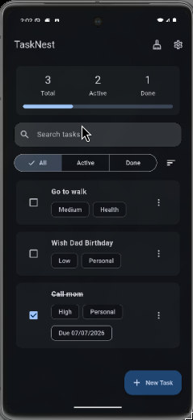
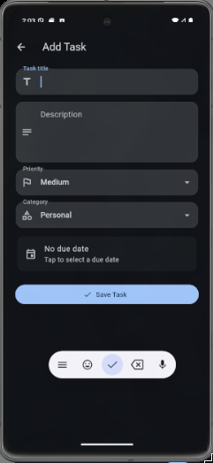
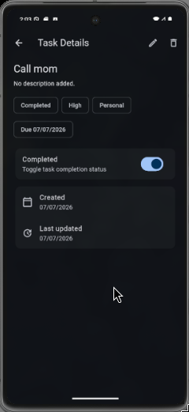
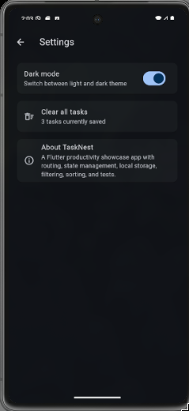

# TaskNest

TaskNest is a polished Flutter productivity app built as a portfolio showcase project. It helps users manage daily tasks with priorities, categories, due dates, search, filters, sorting, local persistence, dark mode, and a clean Material 3 interface.

This project is part of my Flutter learning and portfolio journey.

---

## Overview

TaskNest is not just a basic todo app. It is designed to demonstrate practical Flutter development skills, including clean architecture, routing, state management, local storage, reusable widgets, form handling, testing, and Android release builds.

The app is built with a feature-based folder structure so that it can scale beyond a small demo.

---

## Features

- Add new tasks
- Edit existing tasks
- Delete tasks with confirmation
- Mark tasks as completed or active
- View task details
- Add task descriptions
- Set task priority
- Assign task category
- Add optional due dates
- Search tasks by title, description, or category
- Filter tasks by All, Active, and Done
- Sort tasks by newest, oldest, priority, and due date
- Clear completed tasks
- Clear all tasks from settings
- Light mode and dark mode
- Local persistence using shared_preferences
- Navigation using go_router
- State management using Riverpod
- Widget tests included

---

## Tech Stack

- Flutter
- Dart
- Riverpod
- go_router
- shared_preferences
- Material 3

---

## Screenshots

Add screenshots inside the `screenshots` folder.

Recommended screenshot files:

```text
screenshots/home.png
screenshots/add_task.png
screenshots/details.png
screenshots/settings.png
screenshots/dark_mode.png
```

Example layout for screenshots:

| Home | Add Task | Details |
|---|---|---|
|  |  |  |

| Settings | Dark Mode |
|---|---|
|  |  |

---

## Project Structure

```text
lib/
  app/
    app_router.dart
    app_settings_controller.dart
    app_theme.dart
    tasknest_app.dart

  features/
    settings/
      screens/
        settings_screen.dart

    tasks/
      controllers/
        tasks_controller.dart
      data/
        task_repository.dart
        task_storage_service.dart
      models/
        task.dart
      screens/
        home_screen.dart
        task_details_screen.dart
        upsert_task_screen.dart
      widgets/
        empty_state.dart
        task_card.dart
        task_stats_card.dart

  main.dart
```

---

## Architecture

TaskNest uses a feature-based structure.

### App Layer

The `app` folder contains app-level configuration.

It includes:

- Routing
- Theme setup
- App bootstrap
- App settings state

### Features Layer

The `features` folder contains product features.

Current features:

- Tasks
- Settings

### Tasks Feature

The tasks feature contains:

- Task model
- Local storage service
- Repository layer
- Riverpod controller
- Home screen
- Add and edit screen
- Details screen
- Reusable task widgets

---

## State Management

TaskNest uses Riverpod for state management.

The main task state is handled by:

```text
lib/features/tasks/controllers/tasks_controller.dart
```

The controller manages:

- Task list
- Loading state
- Search query
- Selected filter
- Selected sort option
- Add task
- Update task
- Delete task
- Toggle completion
- Clear completed tasks
- Clear all tasks

---

## Routing

TaskNest uses go_router for navigation.

Routes are defined in:

```text
lib/app/app_router.dart
```

Current routes:

```text
/              Home screen
/add           Add task screen
/task/:id      Task details screen
/edit/:id      Edit task screen
/settings      Settings screen
```

---

## Local Storage

TaskNest uses shared_preferences for local persistence.

The storage logic is inside:

```text
lib/features/tasks/data/task_storage_service.dart
```

Tasks are converted to JSON and saved locally. When the app opens again, saved tasks are loaded back into the app state.

---

## How to Run

Clone the repository and go to the TaskNest project folder:

```bash
cd projects/daily_tasks
```

Install dependencies:

```bash
flutter pub get
```

Run the app:

```bash
flutter run
```

Run on a specific Android emulator:

```bash
flutter devices
flutter run -d emulator-5554
```

---

## Testing

Run static analysis:

```bash
flutter analyze
```

Run widget tests:

```bash
flutter test
```

Expected result:

```text
No issues found
All tests passed
```

---

## Build APK

Build a release APK:

```bash
flutter build apk --release
```

The generated APK will be located at:

```text
build/app/outputs/flutter-apk/app-release.apk
```

---

## Release

The APK should be uploaded through GitHub Releases instead of being committed into the repository.

Recommended release tag:

```text
tasknest-v0.1.0
```

Recommended release title:

```text
TaskNest v0.1.0
```

---

## What This Project Demonstrates

This project demonstrates:

- Flutter app setup
- Android emulator workflow
- Feature-based architecture
- Clean folder organization
- Material 3 UI
- Reusable widgets
- Form validation
- Navigation with go_router
- State management with Riverpod
- Local persistence
- Search, filter, and sort logic
- Light and dark theme handling
- Confirmation dialogs
- Snackbars
- Widget testing
- Android release APK generation
- Git and GitHub workflow

---

## Future Improvements

Possible future improvements:

- App icon
- Splash screen
- Task reminders
- Notifications
- Calendar view
- Drag and drop task ordering
- Cloud sync
- Firebase authentication
- Export and import tasks
- Better animations
- Tablet layout support

---

## Status

Current version:

```text
TaskNest v0.1.0
```

Project status:

```text
Portfolio showcase version completed
```